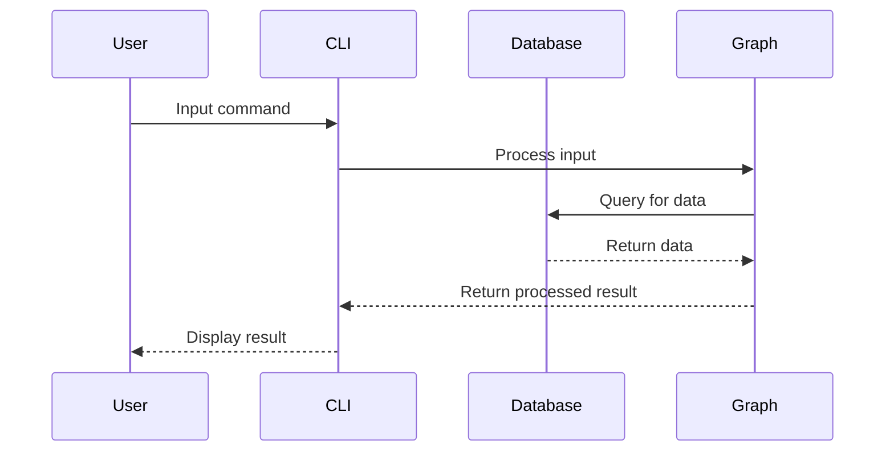
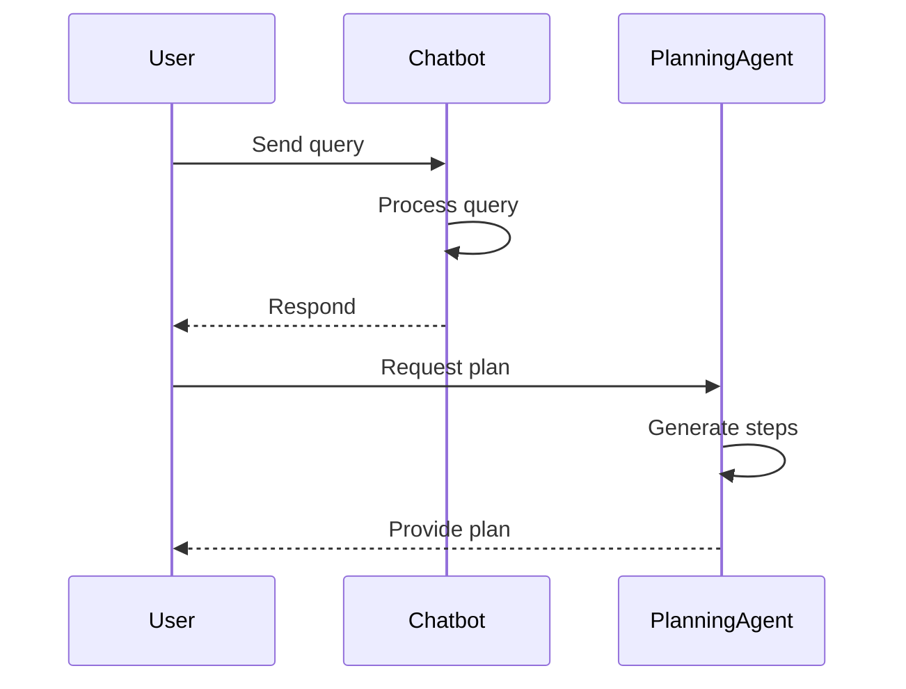

## New Features

- Introduced enhanced functionalities for a chatbot and a planning agent using state graphs.
- Added a new barChartTool for generating bar charts and a basicWebSearch function for web searches.

## Bug Fixes

- Adjusted PostgreSQL connection settings to ensure proper connectivity with the updated port.

## Documentation

- Updated guidelines for creating graphs, emphasizing state management and error handling.

## Tests

- Added unit tests for various functionalities, including the chatbot, planning agent, and bar chart generation.

## Chores

- Updated package configurations and dependencies to improve project setup and testing capabilities.

## Changes

| File(s)                                     | Change Summary                                                                                                         |
| ------------------------------------------- | ---------------------------------------------------------------------------------------------------------------------- |
| `.gitignore`                                | Added entries for temporary files and test assets; removed redundant entries.                                          |
| `docker-compose.yaml`                       | Removed `tmpfs` for PostgreSQL, added persistent storage configuration.                                                |
| `migrations/*.sql`                          | Introduced new migration files to create and populate tables for document management.                                  |
| `package.json`                              | Added new scripts for testing, database management, and environment configuration; updated dependencies.               |
| `packages/cli/package.json`                 | Updated testing framework configurations and added new dependencies for React and CLI enhancements.                    |
| `packages/cli/src/commands/test/graph.ts`   | Enhanced command to process input types and manage configurations more effectively.                                    |
| `packages/cli/src/ui/test.tsx`              | Implemented a React component for shape-based counter applications; added dynamic data fetching.                       |
| `packages/graph/*`                          | Introduced checkpoint management through `PostgresSaver`, added state graphs for chatbot and planning functionalities. |
| `packages/tools/package.json`               | Integrated D3.js and Zod for data visualization and validation; enhanced testing setup.                                |
| `packages/tools/src/generate/bar-chart.ts`  | Created a tool for generating bar charts using D3.js and canvas API; includes input validation.                        |
| `packages/tools/src/retrieve/web-search.ts` | Added web search functionality with input validation; placeholder implementation for search logic.                     |

## Sequence Diagram(s)

