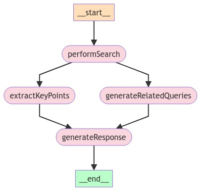

# Search Graph

This module implements a state-based graph for performing web searches, extracting key information, and generating responses based on user queries.



## Key Components

1. **SearchState**: Defines the structure for storing search-related information.

2. **StateGraph**: Utilizes LangChain's StateGraph to manage the flow of operations.

3. **Main Nodes**:

   - `performSearchNode`: Executes the web search using the Tavily API.
   - `extractKeyPointsNode`: Identifies and extracts key points from search results.
   - `generateRelatedQueriesNode`: Creates related queries based on the initial search.
   - `generateResponseNode`: Produces a final response and report based on all gathered information.

4. **Utility Functions**:

   - `filterSearchResults`: Filters search results based on a minimum score.
   - `formatSearchResults`: Formats the search results for further processing.

5. **LLM Integration**: Utilizes GPT models for various natural language processing tasks.

## Workflow

1. The search process begins with a user query.
2. The query is used to perform a web search.
3. Key points are extracted from the search results.
4. Related queries are generated to expand the search scope.
5. A final response and report are generated based on all collected information.

## Usage

The module exports two main functions:

1. `performSearch`: Executes the entire search process and returns the final state.
2. `streamSearchProcess`: Provides a stream of intermediate states during the search process.

## Example Usage

```ts
const result = await performSearch(
  "How do I register to vote in Oregon?",
  config
);
```

## Example Response

```json
{
  "query": "how do I register to vote in Oregon?",
  "searchResults": [
    "State of Oregon: Elections - Voting in Oregon\n\nRegistering to vote in Oregon is quick and simple. Oregonians can register: Online using My Vote. By mail using a voter registration form.This form also is available in multiple languages . In person at the county elections office or at certain state agencies like the DMV. The deadline to register is 21 days before Election Day.[1]",
    "Register to Vote Online in Oregon - Vote.org\n\nOregon. voter registration rulesTo register in Oregon you must: Be a citizen of the United States; Be a resident of Oregon; At least 16 years old (to vote, you must be 18 by Election Day). Oregon. voter registration directionsUse our Register to Vote Tool to fill out the National Voter Registration Form.[2]",
    "State of Oregon: Voting - Update Voter Registration Information\n\nElectronically. If you have an Oregon driver license or state ID card, you can update your information entirely online. Go To My Vote. Enter your name and date of birth. Click Submit. Select Update Registration at the bottom of the page. Answer the two eligibility questions on the next screen. Click Continue.[3]",
    "How to register in Oregon | Vote.gov\n\nStart or update your registration on Oregon's election website. You can also register to vote by mail or in person on Oregon's election website. Voter registration deadlines. Voter registration deadlines for the Tuesday, November 5, 2024 election. Find state and local election dates. Online registration deadline: Tuesday, October 15, 2024[4]",
    "Voter Registration Information - State of Oregon: Voting & Elections\n\nIf you do not have a valid Oregon ID or Social Security number you can find a list of acceptable alternative identification online at oregonvotes.gov. What is the deadline to register? To vote in the May 21, 2024, Primary Election, your completed registration card must be: postmarked by Tuesday, April 30; or; delivered to a county elections ...[5]"
  ],
  "sources": [
    "https://sos.oregon.gov/voting/Pages/voteinor.aspx",
    "https://www.vote.org/register-to-vote/oregon/",
    "https://sos.oregon.gov/voting/Pages/updatevoterregistration.aspx",
    "https://vote.gov/register/oregon",
    "https://oregonvotes.gov/voters-guide/english/geninfo_voterreginfo.html"
  ],
  "keyPoints": [
    "Registering to vote in Oregon is quick and simple, and can be done online, by mail, or in person[^1]",
    "To register in Oregon, you must be a citizen of the United States, a resident of Oregon, and at least 16 years old (you must be 18 by Election Day to vote)[^2]",
    "The deadline to register to vote is 21 days before Election Day[^1]",
    "For the November 5, 2024 election, the online registration deadline is October 15, 2024[^4]",
    "If you do not have a valid Oregon ID or Social Security number, you can find acceptable alternative identification online[^5]"
  ],
  "relatedQueries": [
    "What are the eligibility requirements to register to vote in Oregon?",
    "How can I update my voter registration information in Oregon?",
    "What is the deadline for voter registration in Oregon for upcoming elections?",
    "Can I register to vote in Oregon if I am not a U.S. citizen?",
    "What are the different ways to vote in Oregon after registering?"
  ],
  "report": "## How to Register to Vote in Oregon\n\n### Registration Methods\nOregon offers multiple convenient ways to register to vote:\n- **Online**: \n  - Use the [My Vote](https://sos.oregon.gov/voting/Pages/voteinor.aspx) tool if you have an Oregon driver license or state ID.\n- **By Mail**: \n  - Download and complete the voter registration form, which is available in various languages.\n- **In Person**: \n  - Register at your local county elections office or at designated state agencies like the DMV[^1][^2].\n\n### Eligibility Requirements\nTo register in Oregon, you must meet the following criteria:\n- Be a citizen of the United States.\n- Be a resident of Oregon.\n- Be at least 16 years old (you must be 18 by Election Day to vote) [^2].\n\n### Important Deadlines\n- The deadline to register to vote is **21 days before Election Day**.\n- For the upcoming elections, ensure your registration is completed by the specified deadlines:\n  - For the May 21, 2024, Primary Election, your registration must be postmarked by April 30, 2024[^5].\n\n### Updating Your Registration\nIf you need to update your voter registration, you can do so online if you have an Oregon driver license or state ID. Simply visit the My Vote tool, enter your details, and follow the prompts to update your information[^3].\n\n## References\n[^1]: State of Oregon: Elections - Voting in Oregon  \n[^2]: Register to Vote Online in Oregon - Vote.org  \n[^3]: State of Oregon: Voting - Update Voter Registration Information  \n[^4]: How to register in Oregon | Vote.gov  \n[^5]: Voter Registration Information - State of Oregon: Voting & Elections",
}
  "error": ""
```
